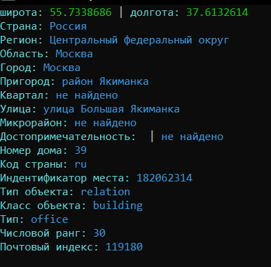
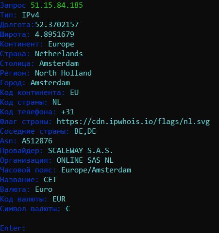
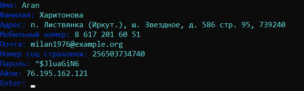
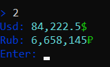
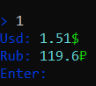
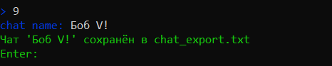
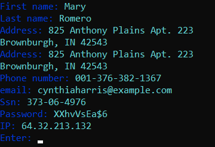

# Hidlow Tool

#### [Russian Version](#russian) | [English Version](#english)
Все персональные данные, показанные на скриншотах, являются вымышленными.  

All personal data shown in the screenshots are fictitious.
****
## Russian

### Проект ``HidlowTools`` - это небольшой сборник утилит в которых имеется более ``13 функций``

**1. ``Number`` - функция, с помощью которой вы можете узнать информацию о мобильном номере телефона.
Использует один из [htmlweb API](https://htmlweb.ru) и выводит более 28 строк с информацией.**

**2. ``Lat/Lon`` - функция, с помощью которой вы можете узнать информацию о координатах по долготе(_lat_) и широте(_lon_).  
Использует [openstreetmap API](https://nominatim.openstreetmap.org) и выводит более 18 строк с информацией**

**3. ``IP`` - функция, с помощью которой вы можете узнать информацию о IP.  
использует [whois API](https://ipwhois.app) и выводит более 22 строк с информацией**

**4. ``QRcode`` - функция, с помощью которой вы можете создавать QRcode в формате ``.png``.  
достаточно просто ввести ``url``, например: ``https://example.com`` и скрипт сам создаст вам готовый файл**

**5. ``FlaskAPI`` - отдельный скрипт, с помощью которого вы можете запустить свой ``API сервер``  
подробно по ссылке: [HidlowAPI](https://github.com/hiikikomorii/API-Server)**

**6. ``Troll`` - отдельный скрипт, который за вас печатает огромное кол-во текста, в которых содержатся провакационные предложения  
подробно по ссылке: [automated-input](https://github.com/hiikikomorii/automated-input)**

**7. ``Faker`` - популярная библиотека для вывода фейковых данных.  
имеет в себе следующие языки: ``Russian`` ``English`` ``Spanish`` ``Japanese``**
  

**8. ``Currency`` - показывает текущий курс ``BTC`` и ``TON``.  
Использует [Coinpaprika API](https://api.coinpaprika.com) и выводит курс в ``RUB`` & ``USD``**
  

**9. ``GPT CHC`` - GPT Chat History Converter.  
Когда вы экспортируете чаты из ``ChatGPT``, вы получаете ``zip-файл``, в котором находится ``conversations.json`` - это ваша история чатов.
Скрипт конвертирует этот файл в .txt для удобного чтения.**

**Поместите .json файл в ту же директорию, что и ``main.py``, 
затем запустите функцию и введите название чата в консоль. После конвертации в той же директории появится ``chat_export.txt``.**

## English

### Project ``HidlowTools`` - a small collection of utilities that contains more than ``13 functions``

**1. ``Number`` - a function that allows you to get information about a mobile phone number.
Uses one of the [htmlweb APIs](https://htmlweb.ru)
and outputs more than 28 lines of information.**

**2. ``Lat/Lon`` - a function that allows you to get information about coordinates by latitude (_lat_) and longitude (_lon_).
Uses the [OpenStreetMap API](https://nominatim.openstreetmap.org)
and outputs more than 18 lines of information.**

**3. ``IP`` - a function that allows you to get information about an IP address.
Uses the [whois API](https://ipwhois.app)
and outputs more than 22 lines of information.**

**4. ``QRcode`` - a function that allows you to create a QR code in ``.png`` format.
Simply enter a ``url``, for example: https://example.com, and the script will create the file for you.**

**5. ``FlaskAPI`` - a separate script that allows you to run your own ``API server``.
More details here: [HidlowAPI](https://github.com/hiikikomorii/API-Server)**

**6. ``Troll`` - a separate script that automatically types a large amount of text containing provocative sentences.
More details here: [automated-input](https://github.com/hiikikomorii/automated-input)**

**7. ``Faker`` - a popular library for generating fake data.
Supports the following languages: ``Russian`` ``English`` ``Spanish`` ``Japanese``**

**8. ``Currency`` - shows the current rates for ``BTC`` and ``TON``.
Uses the Coinpaprika API
 and outputs rates in ``RUB`` & ``USD``**   

**9. ``GPT CHC`` - GPT Chat History Converter.
When you export chats from ``ChatGPT``, you receive a ``.zip file`` containing ``conversations.json`` — this is your chat history.
The script converts this file to .txt for easier reading.**

**Place the .json file in the same directory as ``main.py``,
then run the function and enter the chat name in the console. After conversion, ``chat_export.txt`` will appear in the same directory.**

