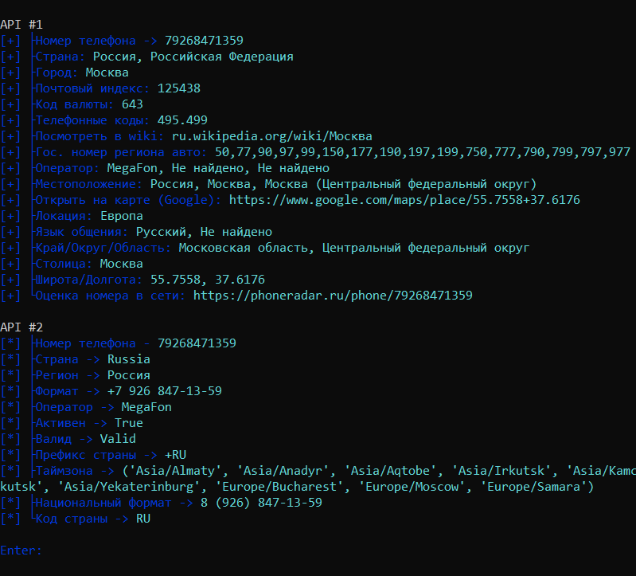

# Hidlow Tools

****
## Russian Version

**Проект HidlowTools - это небольшой сборник утилит
в которых имеется более 13 функций**

**1. ``Number`` -
использует один из [htmlweb api](https://htmlweb.ru/geo/api.php) и выводит более 28 строк с информацией.**

**2. ``IP`` -
использует [whois api](https://ipwhois.app/json/) и выводит**

